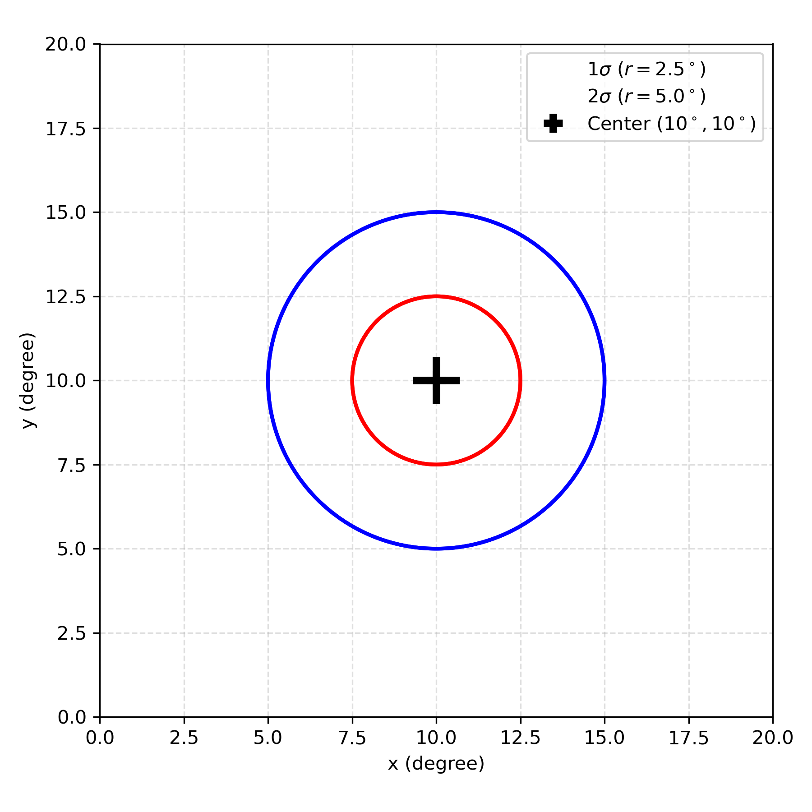

# Experiment: Diabatic heating

## Spatial setup at a glance

The heating is an axisymmetric Gaussian centred on the storm. The horizontal footprint
(and the Deep/Shallow/Stratiform vertical weighting) looks like:



## Physical design

Inject a localized, axisymmetric **diabatic heating** anomaly near the TC core and
watch how the LLAT (DLAMPty / coupled FCNv2) model responds. Heating is the leading
energy source of a tropical cyclone (latent heat release in convection), so this is
the most direct probe of whether the learned model obeys the dynamics that *should*
follow from heating.

Three configs (all init from `202518W`, `2025091700`):

| config | mode | injection | what it isolates |
| --- | --- | --- | --- |
| `ic_bump_Deep_10K` | `forward` | one-shot upper-T bump (Deep profile, +10 K) | immediate balance adjustment to an imposed warm core |
| `continuous_5K_7d` | `continuous` | per-step surface-T forcing, 7 days | sustained-forcing response & track of the growing anomaly |
| `snapshot_5K_iter20` | `snapshot` | per-iteration forcing, frozen time | the fastest-growing finite-time mode at one valid time |

Vertical heating profiles (`heat_type`): **Deep** (single half-sine, mid-tropospheric
peak — deep convection), **Stratiform** (full sine — heating aloft / cooling below,
mature-stage anvil), **Shallow** (low-level peak — shallow convection).

## Why we expect a particular response (physics to check)

- **Hydrostatic balance:** a warm anomaly lowers the column thickness gradient aloft
  and raises geopotential above the heating; the surface should respond with a
  pressure fall under the heating. Check that Δθ and Δz are hydrostatically
  consistent. `hydrostatic.py` quantifies the **non-hydrostatic degree** two ways:
  *Strategy 1* forms the vertical-momentum residual `ε = |Dw/Dt|/g` (steady-state,
  spherical, with the `−(u²+v²)/A` curvature term; `∂w/∂t` neglected in `snapshot`
  mode) — ε≈10⁻⁴–10⁻³ flags a hydrostatic column, ε→10⁻¹ a non-hydrostatic core;
  *Strategy 2* checks the isobaric hydrostatic equation `∂Φ/∂P = −RT/P` as a z↔T
  consistency test. Both draw a pressure-on-y profile (domain + eyewall) **and** an
  azimuthal-mean radius–height map; the evolution suite also animates the maps.
- **Gradient-wind / geostrophic adjustment:** the mass perturbation cannot stay
  unbalanced. Within the Rossby radius of deformation it radiates gravity waves and
  settles toward gradient-wind balance; outside it, a balanced vortex response. The
  `waves.py` radius–time diagnostic is built to expose exactly this.
- **PV generation:** diabatic heating generates potential vorticity below the heating
  maximum and destroys it above (∂PV/∂t ∝ ∂(heating)/∂z along the absolute-vorticity
  vector). A physically faithful model should build a low-level PV tower under
  sustained heating. Compare `pv.py` cross-sections of control vs perturbed.
- **Integrated kinetic energy response:** `ike.py` reuses the Part-1 IKE core to ask how
  much the storm's IKE changes under the perturbation — `ΔIKE = IKE(ū+δ) − IKE(ū)` split
  into total / inner (r<200 km) / outer (r≥200 km), plotted vs iteration (one summary
  curve per run, same IKE definition as the operational dashboard).

## How it is implemented

`perturbation.type: heating` → `llat_manifold.perturbations.heating.HeatingPerturbation`.
`injection: ic` adds the bump to the upper-T column at t=0 (`apply_ic`); `per_step`
adds a TC-following Gaussian to the surface-T perturbation each step (`apply_step`).
Heating claims **no** static variables, so the full static-variable lock applies.

## Run

```bash
conda activate pangu_env
python scripts/run_experiment.py --config experiments/diabatic_heating/configs/continuous_5K_7d.yaml
```

The run folder is named with the init time, e.g.
`outputs/diabatic_heating/continuous_5K_7d_init2025091700/`, and contains:

```
data/           δ/state bundles (*.npz)
plots/          PV_Theta_tengential.png   (PV–θ + heating profile + tangential wind)
                wind_circulation.png      (|v| shading + u–w secondary-circulation quiver)
                div_Theta_uv.png          (divergence–θ + heating profile)
                wind_balance_profile.png  (LLAT vs gradient vs geostrophic wind)
                fields.png                (Part 1 5-row 2D field grid)
                hydrostatic_eps_profile.png / _xsection.png      (Strategy 1: ε=|Dw/Dt|/g non-hydrostatic check)
                hydrostatic_thermo_profile.png / _xsection.png   (Strategy 2: ∂Φ/∂P vs −RT/P z↔T consistency)
                ike_perturbation.png      (ΔIKE total/inner/outer vs iteration; one curve per run)
                hovmoller_msl.png         (radius–time gravity-wave Hovmöller; continuous runs)
                evolution/                per-iteration frames + GIFs (incl. hydrostatic_eps/_thermo) + growth_curves.png
config_used.yaml
README.md       auto-generated: data source, run info, inline figures
```

The standard plot suite runs automatically after the model run (disable with
`--no-plots`). To re-render a single figure by hand:

```bash
RUN=outputs/diabatic_heating/continuous_5K_7d_init2025091700
python -m llat_manifold.diagnostics.pv           $RUN/data/<bundle>.npz --out $RUN/plots/PV.png
python -m llat_manifold.diagnostics.pv           $RUN/data/<bundle>.npz --wind --out $RUN/plots/wind_circ.png
python -m llat_manifold.diagnostics.divergence   $RUN/data/<bundle>.npz --out $RUN/plots/div.png
python -m llat_manifold.diagnostics.wind_profile $RUN/data/<bundle>.npz --out $RUN/plots/wind_bal.png
python -m llat_manifold.diagnostics.fields       $RUN/data/<bundle>.npz --out $RUN/plots/fields.png
python -m llat_manifold.diagnostics.waves        $RUN/data --var msl     --out $RUN/plots/hov.png
# Non-hydrostatic checks (writes *_profile.png + *_xsection.png for each strategy):
python -m llat_manifold.diagnostics.hydrostatic  $RUN/data/<bundle>.npz --baseline $RUN/data/background.npz \
       --out-dir $RUN/plots --strategy both
# Per-iteration evolution frames + GIFs (e.g. just the two hydrostatic maps):
python -m llat_manifold.diagnostics.evolution    $RUN --diag hydro_eps,hydro_thermo
# Perturbation IKE response (ΔIKE total/inner/outer vs iteration; one figure per run):
python -m llat_manifold.diagnostics.ike          $RUN --out $RUN/plots/ike_perturbation.png
```

For semi-linear (δ) bundles, pass the matching control to get physical Δ-PV:
`--baseline <control_bundle>.npz --add-to-baseline`. The hydrostatic checks instead take
`--baseline <background>.npz` to reconstruct the absolute state ū+δ (snapshot mode).

## Committed runs (outputs index)

The run folders live at the repo root under `outputs/diabatic_heating/`. (The
`experiments/diabatic_heating/outputs` path is a symlink and does not expand on GitHub —
use the links below.) Each run keeps its `README.md`, `config_used.yaml` and `plots/*.png`;
the heavy `data/*.npz` bundles are git-ignored and regenerated on demand.

### `snapshot_5K_iter20` — init `2025091700`

- 📄 [Run README](../../outputs/diabatic_heating/snapshot_5K_iter20_init2025091700/README.md)
  · ⚙️ [config_used.yaml](../../outputs/diabatic_heating/snapshot_5K_iter20_init2025091700/config_used.yaml)
- 🖼 Figures:
  [PV–θ + tangential wind](../../outputs/diabatic_heating/snapshot_5K_iter20_init2025091700/plots/PV_Theta_tengential.png)
  · [wind circulation](../../outputs/diabatic_heating/snapshot_5K_iter20_init2025091700/plots/wind_circulation.png)
  · [divergence–θ](../../outputs/diabatic_heating/snapshot_5K_iter20_init2025091700/plots/div_Theta_uv.png)
  · [wind balance profile](../../outputs/diabatic_heating/snapshot_5K_iter20_init2025091700/plots/wind_balance_profile.png)
  · [fields](../../outputs/diabatic_heating/snapshot_5K_iter20_init2025091700/plots/fields.png)

### `snapshot_5K_iter20` — init `2025092000`

- 📄 [Run README](../../outputs/diabatic_heating/snapshot_5K_iter20_init2025092000/README.md)
  · ⚙️ [config_used.yaml](../../outputs/diabatic_heating/snapshot_5K_iter20_init2025092000/config_used.yaml)
- 🖼 Figures:
  [PV–θ + tangential wind](../../outputs/diabatic_heating/snapshot_5K_iter20_init2025092000/plots/PV_Theta_tengential.png)
  · [wind circulation](../../outputs/diabatic_heating/snapshot_5K_iter20_init2025092000/plots/wind_circulation.png)
  · [divergence–θ](../../outputs/diabatic_heating/snapshot_5K_iter20_init2025092000/plots/div_Theta_uv.png)
  · [wind balance profile](../../outputs/diabatic_heating/snapshot_5K_iter20_init2025092000/plots/wind_balance_profile.png)
  · [fields](../../outputs/diabatic_heating/snapshot_5K_iter20_init2025092000/plots/fields.png)
