# Run: diabatic_heating / snapshot_10K_iter20_init2025092000

_Auto-generated by `scripts/run_experiment.py`._

## Data source

- real-case background IC for TC **202518W**, init **2025092000** (FCNv2 analysis + DLAMPty combined NetCDF)

## Run info

- **Mode:** `snapshot`
- **Horizon:** `iterations=20`
- **Perturbation:** `heating` — injection=per_step, amp_K=10.0, heat_type=Deep, forcing_steps=20, amp_mode=each, sigma=5.0

## Visuals

### PV_Theta_tengential

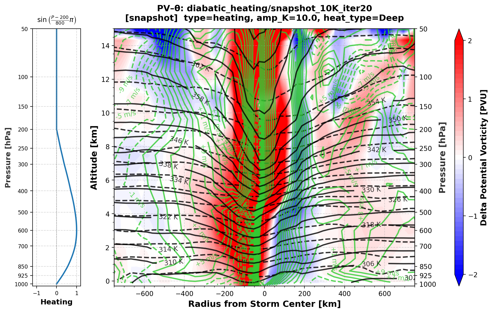

### div_Theta_uv

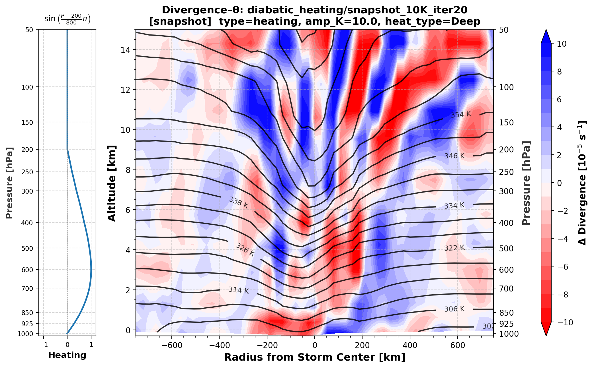

### fields

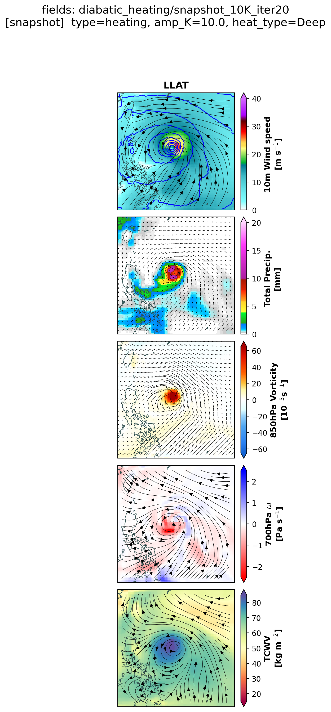

### wind_balance_profile

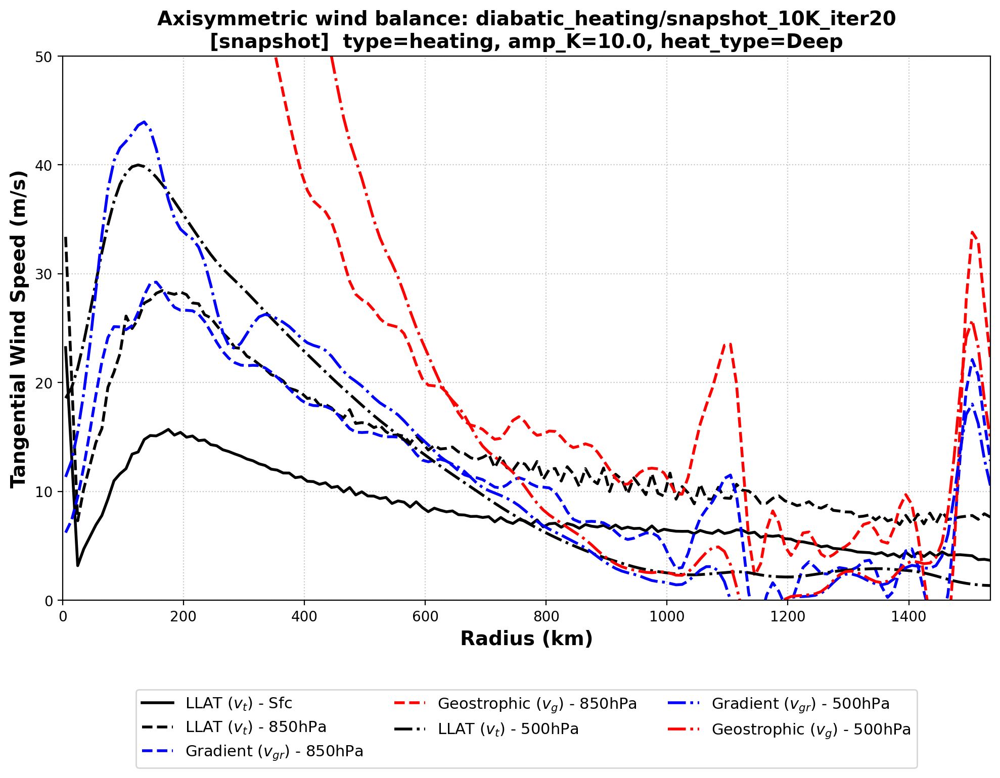

### wind_circulation

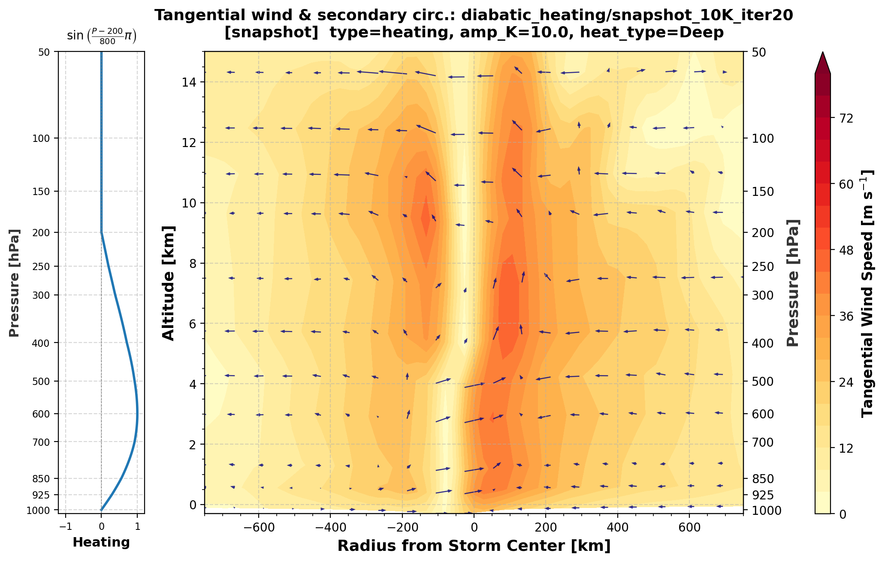

### growth_curves

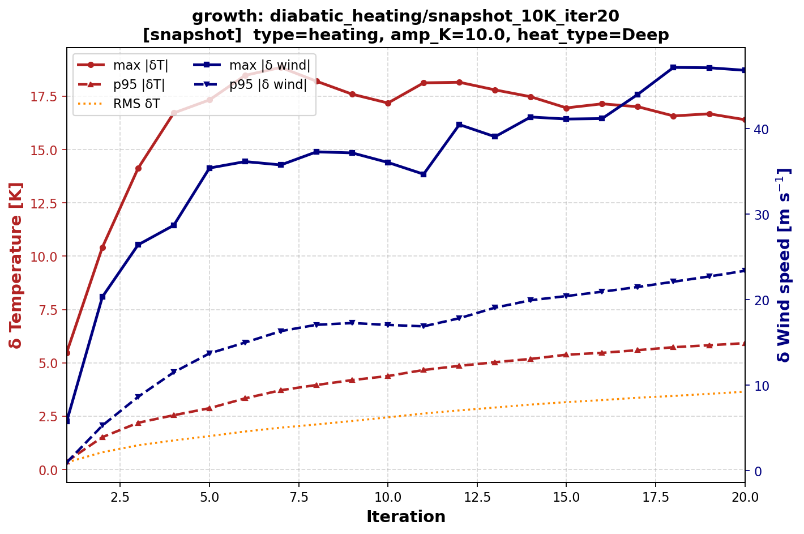

### PV_Theta/iter001

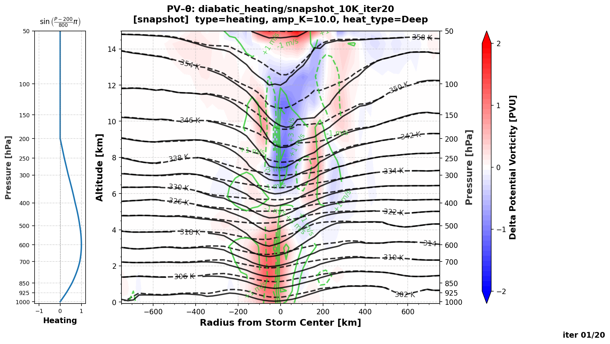

### PV_Theta/iter020

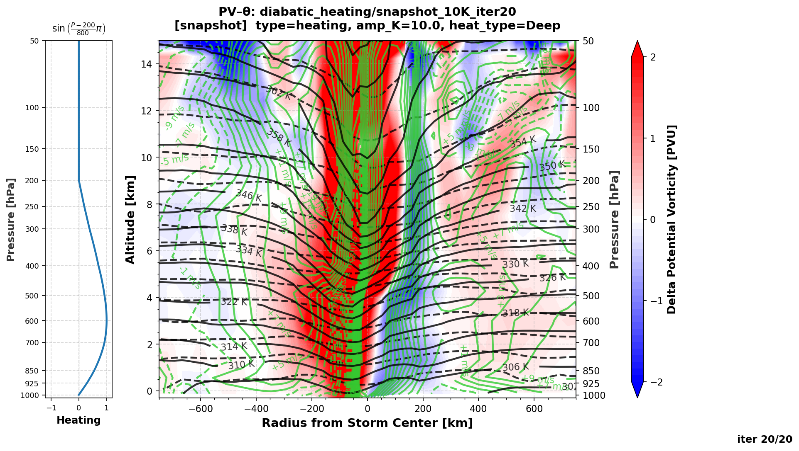

### div_Theta/iter001

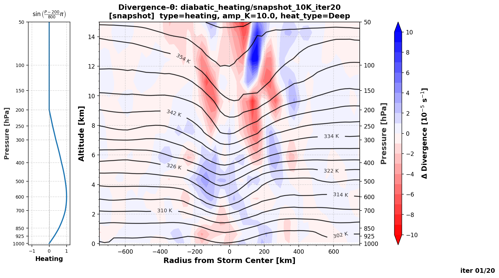

### div_Theta/iter020

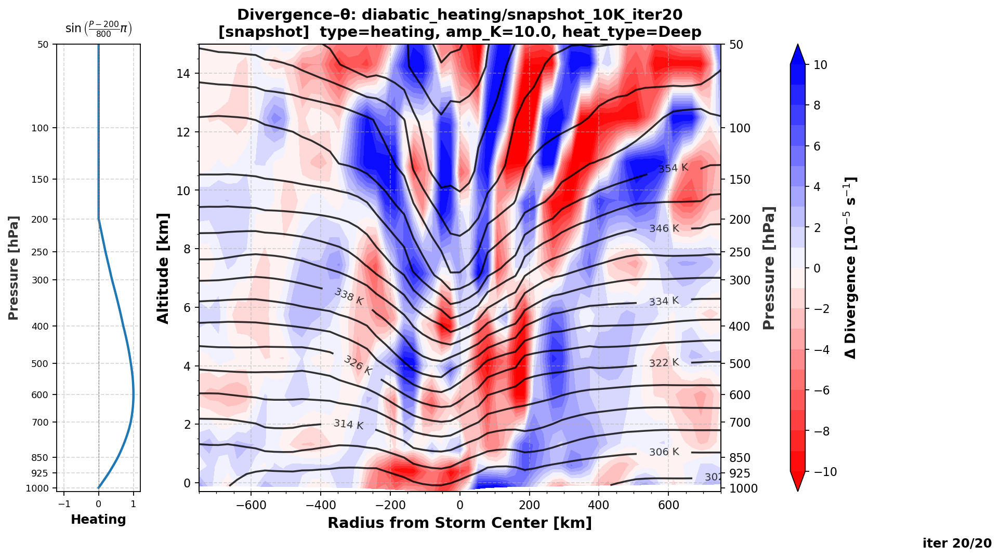

### fields/iter001

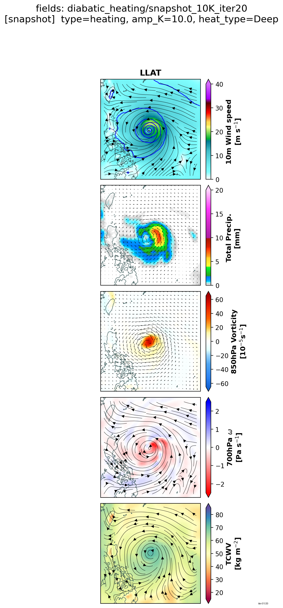

### fields/iter020

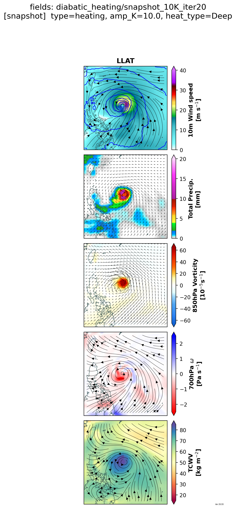

### wind_balance/iter001

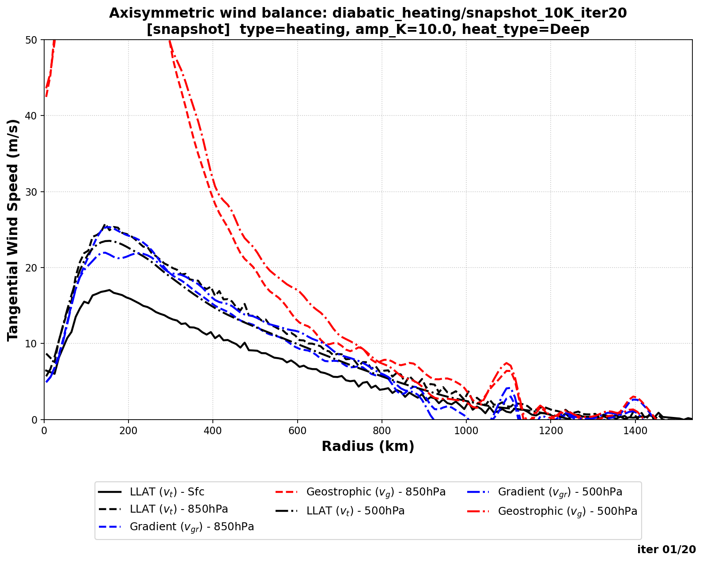

### wind_balance/iter020

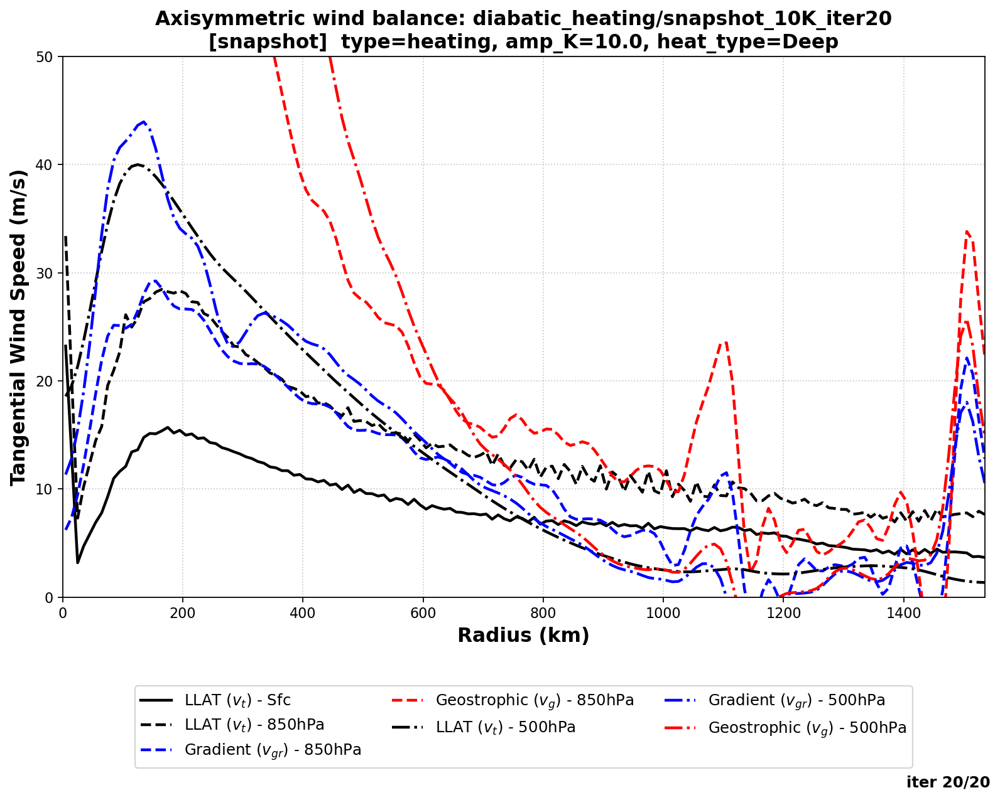

### wind_circulation/iter001

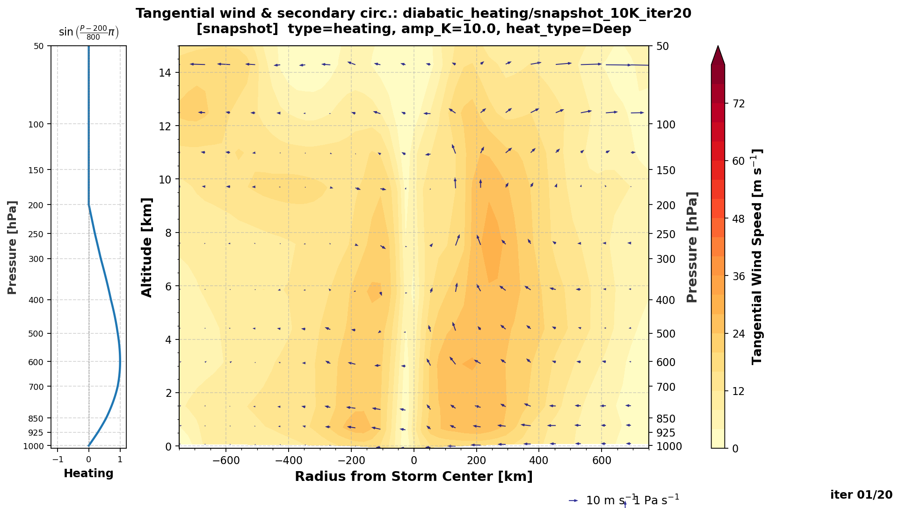

### wind_circulation/iter020

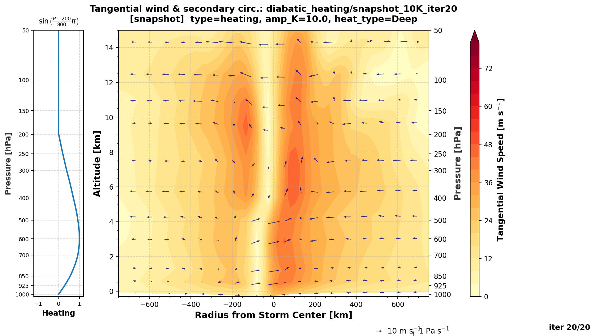

## Files

- `data/` — perturbation/state bundles (`*.npz`, keys `fcnv2` / `dlampty_upper` / `dlampty_sfc`).
- `plots/` — figures linked above.
- `config_used.yaml` — the exact resolved config + provenance.
